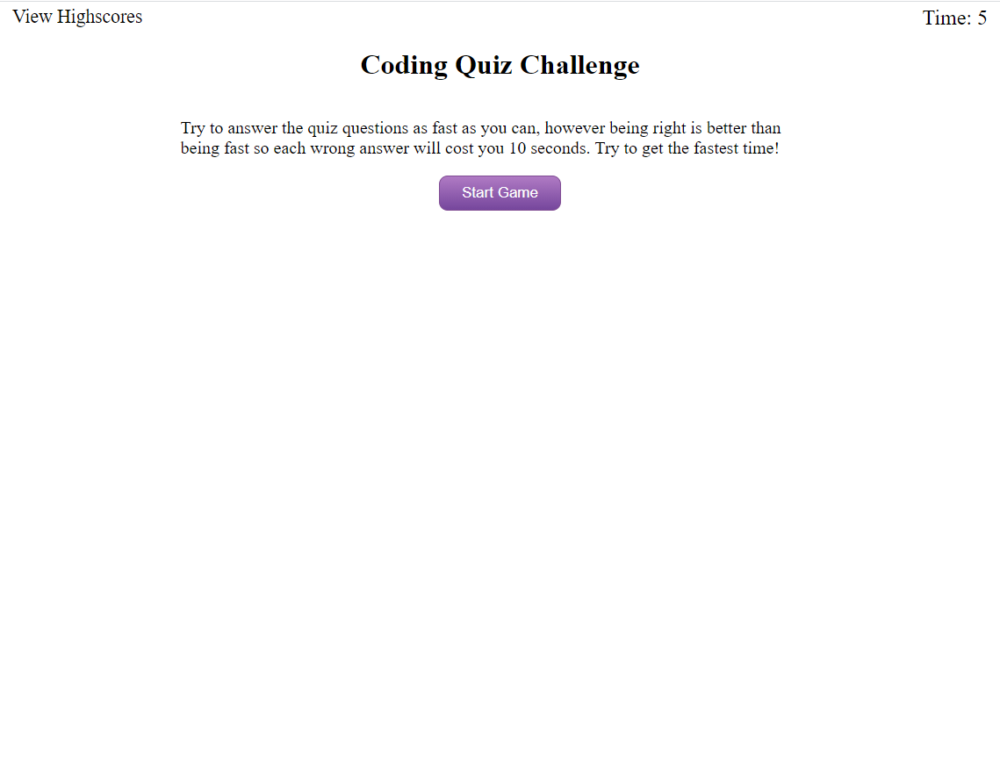

# Javascript Quiz

https://j92pruitt.github.io/javascript-quiz/

## Description

A simple website featuring a timed java script quiz. The site uses javascript to dynamically change the webpage in order to display questions. The quiz includes a persistent highscore list and deducts time for incorrect answers.

## Conclusion
Through this project I was able to explore creating dynamic pages using javascript, in particular I got a lot of experience using the javascript to manipulate the DOM. I also learned alot about scripting website flow using javascript functions.

## Credits
* Button styling was achieved using https://www.bestcssbuttongenerator.com
* Questions pulled from http://mcqspdfs.blogspot.com/2013/08/60-top-javascript-multiple-choice.html and https://www.tutorialspoint.com/javascript/javascript_online_quiz.htm